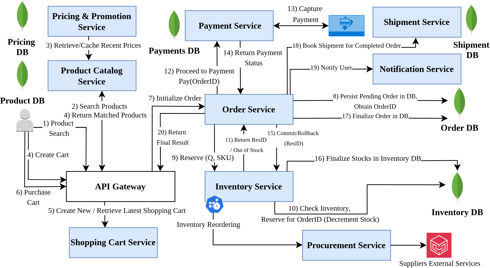

# Automated Architecture Refactoring Microservice Systems To LLM-Based Multi-Agent Systems

## Microservice System Baseline:

## Claude Code Workflow

1. Create CLAUDE.md (your “control plane”)

This is CRITICAL — Claude Code uses this as persistent memory and rules.

2. Define reusable Skills (your pipeline building blocks)

Skills = reusable workflows Claude can invoke automatically.

3. Define a Master Orchestrator Agent

Claude Code supports agentic workflows that break tasks into steps automatically

4. Connect real systems using MCP

Claude Code can call external tools via MCP (Model Context Protocol)

5. Hooks = your safety guardrails (automatic decision enforcement)

Hooks run automatically at lifecycle events.
